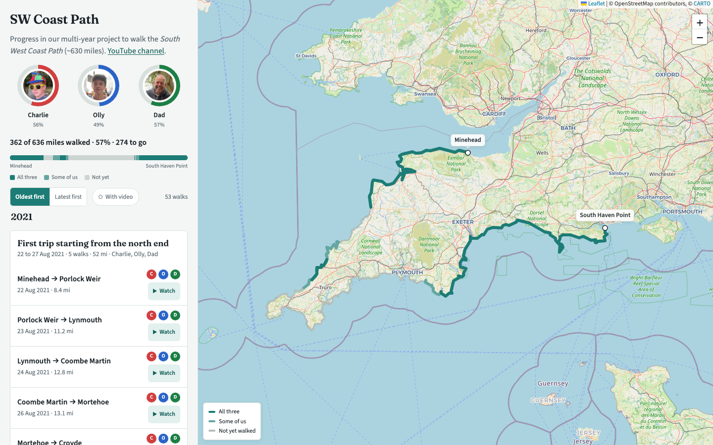

# SW Coast Path



A small website designed to document the progress of myself, my dad, and my brother around the South West Coast Path. [View it live here](https://projects.ollybritton.com/swcp).

## Layout

Plain HTML/CSS/JS, no build step, no framework. `index.html` loads Leaflet, Turf, `leaflet-corridor.js`, `data.js`, then the app's own scripts as classic (non-module) files sharing top-level globals — load order matters:

- `js/helpers.js` — shared config, DOM handles, filter/sort state, and small pure helpers (dates, walker colours, geometry).
- `js/map.js` — Leaflet setup, route loading/slicing, drawing walked sections, markers.
- `js/model.js` — turns `HIKE_DATA` into the sections/trips/year-groups the rest of the app reads.
- `js/list.js` — the sidebar list (years → trips → walks) and its filter/sort controls.
- `js/header.js` — walker avatars with progress rings, overall stats, the pinned-walker chip.
- `js/mobile.js` — fitting the map to walks/trips, and the mobile bottom sheet.
- `js/main.js` — boot sequence; dispatches `app:ready` once everything is drawn and wired.

Stylesheets mirror the same split: `css/base.css` (design tokens, reset, page layout, typography, shared utilities), `css/header.css`, `css/list.css`, `css/map.css`, `css/mobile.css` (the ≤860px bottom-sheet layout).

## Datapoints
Data is manually wrangled into the following object, through a [Google Sheet](https://docs.google.com/spreadsheets/d/10E8o0ktfe1anSCR7FRXMTvl35Ae5ixQi1FFj5XI_Em4/edit?gid=0#gid=0) (private).
```js
{
    start: "",
    end: "",
    direction: "N/S",
    startCoords: [],
    endCoords: [],
    charlie: ,
    dad: ,
    olly: ,
    videoLink: "", // https://youtu.be link 
    fixEnd: true // Set this if a marker not already there (e.g., at the end of a N/S stretch or when discontinuous)
}
```
